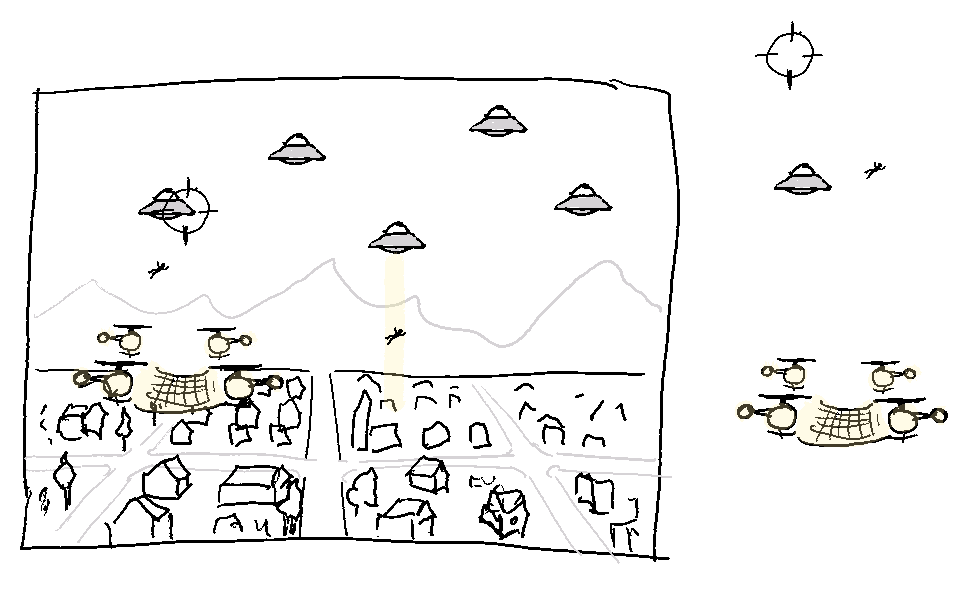
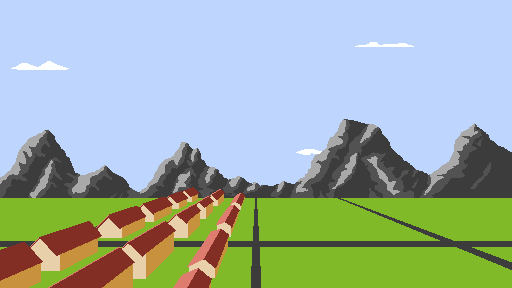
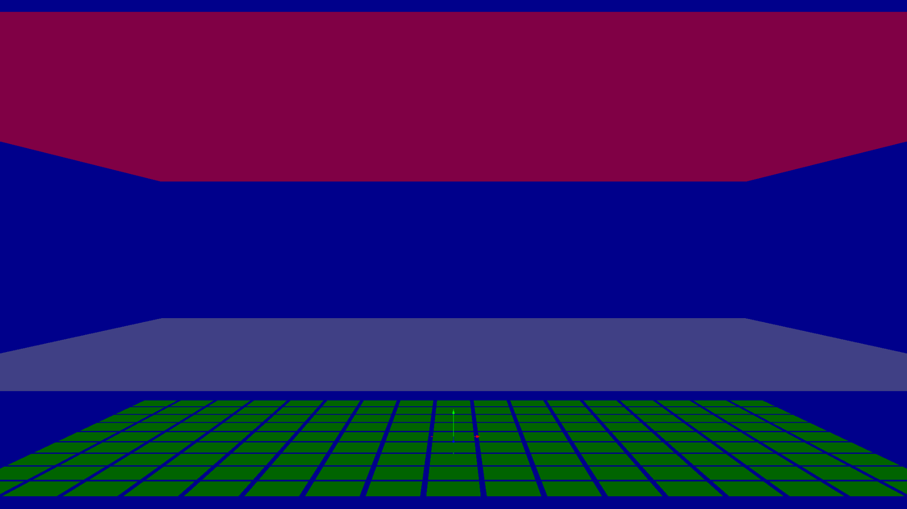
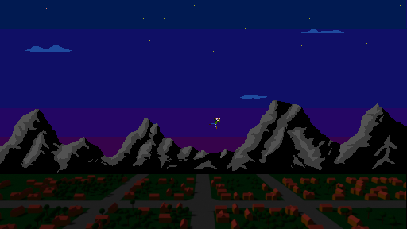
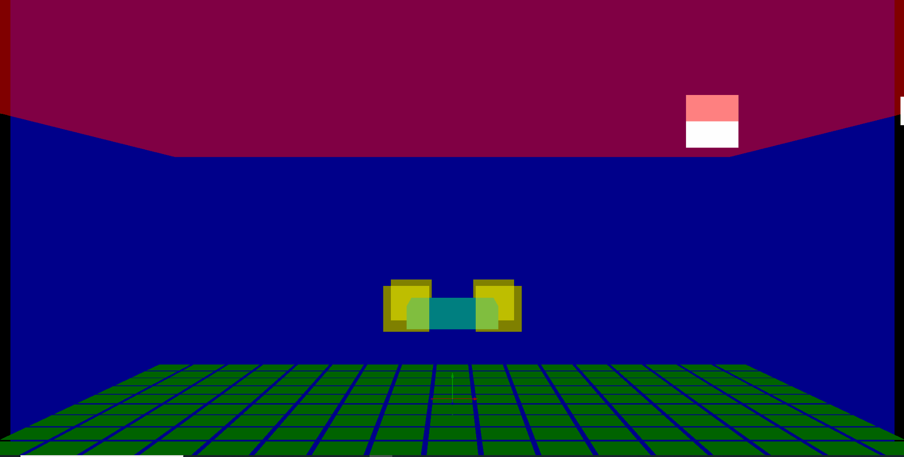
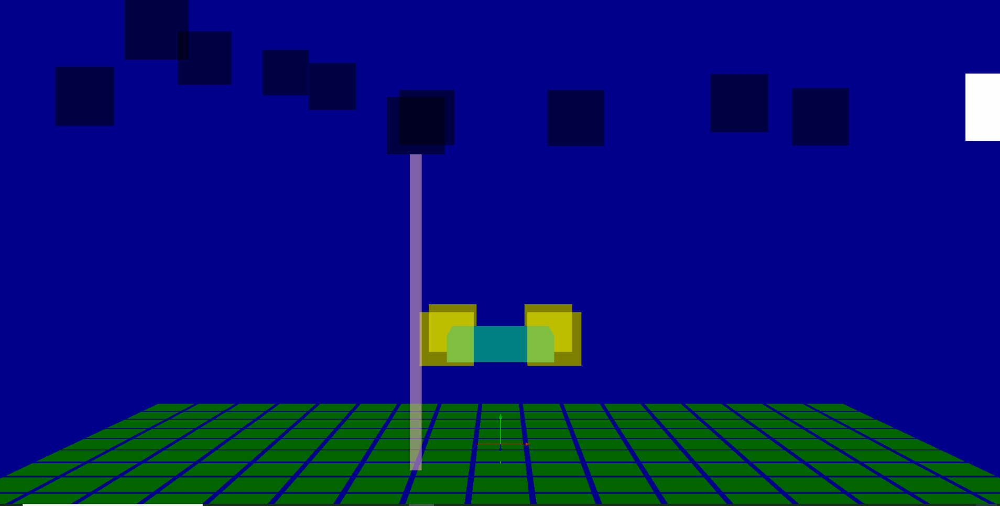
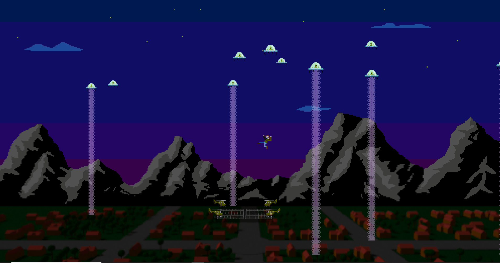

# UfoundLost
A 50's B-movie alien invasion horror game made with FUDGE during the global game jam 2021

**[Play the current prototype](https://jirkadelloro.github.io/UfoundLost/UfoundLost.html)**

## Day 1
Coming up with ideas for the theme "Lost And Found". Instead of having the player losing things in the game and finding them again, one idea was to make others lose stuff and try to find or catch it. 

## Day 2
That's what the plot became: Aliens invade a small suburb and try to suck up people into their UFOs as samples of lifeforms alien to them. Fortunately, the mayor of the town is a military fan and placed a flak and some remote controlled helicopters on the towns central park for worship. These toys come in handy now. While the detonations of the flak's projectiles distort the UFOs traktor beams, making them loose the humans halfway up, the choppers can try to catch the citizens with a net spanning between them. Here's a first scribble.

In the evening, Elli and Monika already created some sprites and a first draft of the scenery  
  

## Day 3
A small design document was created to nail down some core functionality and behaviours.
[Docu/Design.pdf](Docu/Design.pdf)

<object data="Docu/Design.pdf" type="application/pdf" width="100%" height="500px">
    <embed src="Docu/Design.pdf"> </embed>
</object>

## Day 4
Started at 7.00 (7am)
### 9.00 (10am)
- Downloaded some audio from https://freesound.org/  
- Started the Github-Repository
- Programming started! Here is the first generated scene displaying the space the objects are supposed to move in.

[Browse the repository at this point of time](https://github.com/JirkaDellOro/UfoundLost/tree/94f596fed257a97009c3de4488d8909333c6d50a)

### 15.00 (3pm)
Ellie has sent some more sprites and a new background  

The controls are pretty much done, so far solely with placeholders. The mouse controls a target point the crosshair slowly moves towards. On mouseclick, a flak projectile detonates at the crosshair position. The pack of helicopters is controlled by the keyboard. Starting and landing in the middle of the town is not implemented yet.  
  

[Browse the repository at this point of time](https://github.com/JirkaDellOro/UfoundLost/tree/cc46f98537252cf08e12f2bf65d5400810d82ecb)

### 17.00 (5pm)
A simple Ufo-AI...    
  
[Browse the repository at this point of time](https://github.com/JirkaDellOro/UfoundLost/tree/068f5789cdff7bcbd6b0561bce198838f22c05b5)

### 20.00 (8pm)
Integrated Ellie's pixel art!!   
  
[Browse the repository at this point of time](https://github.com/JirkaDellOro/UfoundLost/tree/5882b9af0bba3465706ea5a4bf4762b56503bd39)  

### 24.00 (0am)
Sounds edited and integrated! Time to sleep...

## Day 5 (Final)
It's 7.00 (7am), coffee is hot and a snack is prepared... let's get some villagers kidnapped.

### 11.00 (11am)
Ufos now suck up villagers with their tractor beam. When a flak projectile detonates near them, they wiggle and lose the villager they are about to suck. If they stabilize in time to find the villager again with the beam, the keep pulling them up. Otherwise... SPLAT!  
  
[Browse the repository at this point of time](https://github.com/JirkaDellOro/UfoundLost/tree/0f3ca54056da7ede3f491573d04c2021dcfb8143)  